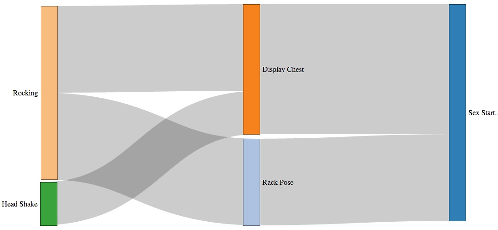

Sankey Diagram: Dialog between bonobos
=========

A d3.js project showing the progression of gestural dialog leading to a social interaction.  On the left are the Permission Request gestures performed by one bonobo in a dyad.  The middle gestures are performed by the second bonobo to the first as a Permission Grant.  Finally once both gestures have been performed the social interaction can commence.  In this example a female bonobo intitialized the dialog with either the Rocking gesture or the Head Shake gesture.  The male bonobo then responds with either the Rack Pose or Display Chest gesture.  Once this sequence of gestures has taken place then the male and female bonobo will continue with penitrative sex.

=======

